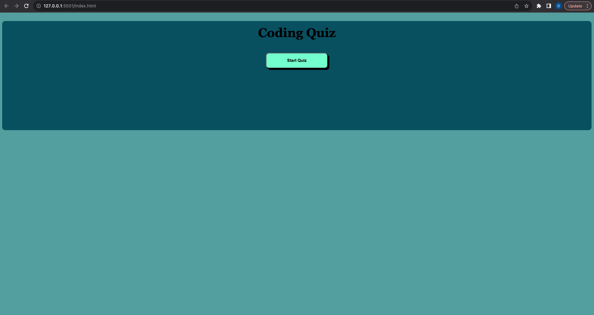

# coding-quiz

## description

When the start button is clicked the timer starts and the first question is presented

When you click the answer, you are alerted with an incorrect or correct answer response.

If incorrect, 10 seconds is deducted from the final time. 

## screenshot

